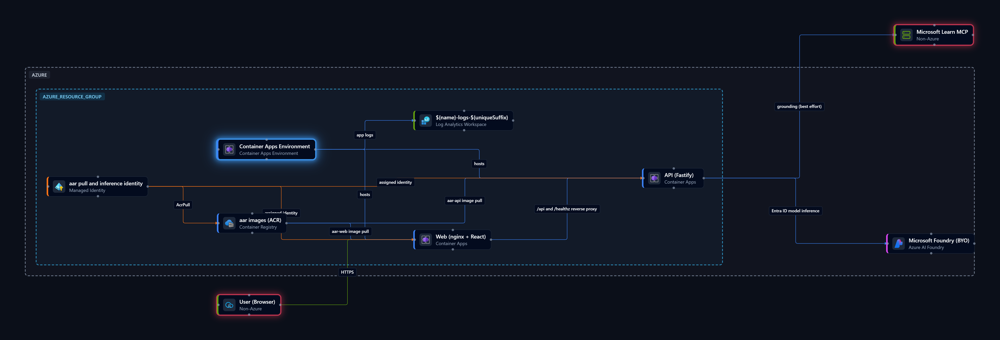

# Azure Architecture Review

> Design, review, and cost Azure architectures on an interactive canvas — self-hosted, open source, and AI-optional.

[](LICENSE)

Azure Architecture Review is a self-hostable diagram builder for your
Architecture Review Board (ARB) process. Draw Azure architectures on an
interactive canvas, generate them from natural language or a screenshot, or
import them from Infrastructure as Code or a live subscription. Then validate the
design against Well-Architected principles, model resiliency and cost, and export
Bicep or Terraform — all inside your own environment.

> Inspired by the Azure Architecture Diagram Builder, rebuilt open source with a
> significantly upgraded UI and bring-your-own AI so teams can self-host it for
> ARB reviews. **Status:** active early development — see the [roadmap](docs/PROGRESS.md).



## Features

- **Interactive canvas** — drag and drop Azure services from a categorized palette, group them by subscription, resource group, VNet, or subnet, auto-arrange the layout, and edit properties.
- **AI prompt-to-diagram** — generate or modify a diagram from natural language, or transcribe one from a pasted screenshot.
- **Unified AI advisor** — ask architecture questions about the current diagram and apply suggested edits.
- **AI architecture review** — a cross-pillar Well-Architected review, optionally grounded in Microsoft Learn.
- **Well-Architected validation** — a deterministic rule engine over the diagram model, with no AI required.
- **Resiliency modelling** — composite SLA, RPO/RTO, and weakest-link analysis with a canvas overlay.
- **Cost and throughput** — per-service and total monthly estimates plus bottleneck sizing against a load target.
- **Infrastructure as Code export** — deterministic Bicep and Terraform generation, previewed and downloaded in-app.
- **Import** — from ARM/Bicep templates, a public Git repository, or a live Azure resource group.
- **Bring-your-own AI** — Microsoft Foundry or Azure OpenAI with keyless Entra ID auth. AI is optional; every other feature works without it.
- **Export** — save diagrams as PNG, SVG, or JSON.

## Quick start

### Prerequisites

- **Node.js** ≥ 20 (22 recommended)
- **pnpm** ≥ 9 — `npm install -g pnpm@9`
- **Docker** — optional, for the containerized run

### Run locally

```bash
pnpm install
cp .env.example .env   # optional — add AI credentials to enable AI features
pnpm dev               # web on http://localhost:5173, API on http://localhost:8080
```

Open <http://localhost:5173> and drag a service onto the canvas to confirm it is
running. For a full walkthrough — enabling AI, Docker, and troubleshooting — see
the [Getting started guide](docs/getting-started.md).

### Run with Docker

```bash
docker compose up --build   # app on http://localhost:8080
```

The web container reverse-proxies `/api` and `/healthz` to the API, so everything
is served from a single origin.

## Documentation

| Guide | What it covers |
| ----- | -------------- |
| [Getting started](docs/getting-started.md) | Step-by-step install, running locally and in Docker, enabling AI, troubleshooting |
| [Configuration](#configuration) | AI provider and environment variables |
| [Deploy to Azure](#deploy-to-azure) | Bicep infrastructure and GitHub Actions CI/CD |
| [Architecture decisions](docs/adr/README.md) | The "why" behind the key technical choices (ADRs) |
| [Roadmap](docs/PROGRESS.md) | Current status and what's planned |
| [Contributing](CONTRIBUTING.md) | Development workflow and ground rules |

## Architecture

A pnpm monorepo ([ADR-0001](docs/adr/0001-monorepo-and-stack.md)):

| Path                | What it is                                                          |
| ------------------- | ------------------------------------------------------------------- |
| `apps/web`          | React + Vite + TypeScript, Tailwind + shadcn/ui, React Flow canvas  |
| `apps/api`          | Fastify + TypeScript API (catalog, AI generate/advise/review, validation, resiliency, cost, IaC, imports) |
| `packages/shared`   | Zod diagram schema + Azure service catalog (single source of truth) |
| `tools/catalog-sync`| Detects new Azure resource types (AVM + icons) and drafts catalog candidates |
| `infra`             | Bicep for Azure Container Apps                                       |

Well-Architected, resiliency, and cost analysis are computed by deterministic
functions in `packages/shared`; a single model call then synthesises the
cross-pillar review, rather than separate per-pillar agents. See
[docs/architecture-flow.md](docs/architecture-flow.md) for a diagram of the
prompt, AI, and deterministic calls.

## Configuration

AI features use **bring-your-own Microsoft Foundry or Azure OpenAI**
([ADR-0003](docs/adr/0003-ai-provider-byo-azure-openai.md)). Set these in `.env`;
leave them blank to run without AI:

| Variable                     | Description                                                               |
| ---------------------------- | ------------------------------------------------------------------------- |
| `AZURE_FOUNDRY_ENDPOINT`     | Microsoft Foundry resource endpoint, e.g. `https://<resource>.services.ai.azure.com` |
| `AZURE_FOUNDRY_MODEL`        | Foundry model/deployment name, e.g. `gpt-5-mini`                          |
| `AZURE_FOUNDRY_RESOURCE_ID`  | Optional ARM resource ID used to discover compatible review deployments   |
| `AZURE_FOUNDRY_API_KEY`      | Optional Foundry API key; leave blank to use Entra ID                     |
| `AZURE_FOUNDRY_API_VERSION`  | Foundry model-inference API version (default `2024-05-01-preview`)       |
| `AZURE_OPENAI_ENDPOINT`      | Your Azure OpenAI / Foundry resource endpoint                             |
| `AZURE_OPENAI_API_KEY`       | Optional API key (server-side only); leave blank to use Entra ID          |
| `AZURE_OPENAI_DEPLOYMENT`    | Model deployment name (e.g. `gpt-4o`)                                    |
| `AZURE_OPENAI_API_VERSION`   | API version (default `2024-10-21`)                                        |

Use the `AZURE_FOUNDRY_*` variables for a Microsoft Foundry resource. Use the
`AZURE_OPENAI_*` variables for an Azure OpenAI-compatible endpoint. When both
are supplied, the explicit Foundry configuration takes precedence.

For keyless authentication, leave `AZURE_OPENAI_API_KEY` blank and authenticate
the API host with `az login` locally, or a managed identity/workload identity in
Azure. Grant that identity the **Cognitive Services OpenAI User** role on the
Azure OpenAI resource. See [ADR-0011](docs/adr/0011-entra-id-keyless-azure-openai-auth.md).

The architecture review can list compatible deployments from a Foundry resource.
Set `AZURE_FOUNDRY_RESOURCE_ID` to the full resource ID of its
`Microsoft.CognitiveServices/accounts` resource. Discovery always uses
`DefaultAzureCredential`, even when inference uses `AZURE_FOUNDRY_API_KEY`. Run
`az login` for local development, or configure a managed/workload identity in
Azure, and grant it `Microsoft.CognitiveServices/accounts/deployments/read`
(the built-in **Reader** role on the Foundry resource includes this action).
Only succeeded chat-completion deployments advertising JSON response support are
offered. If discovery or authorization fails, reviews remain available with the
configured `AZURE_FOUNDRY_MODEL` and the panel shows a warning. See
[ADR-0015](docs/adr/0015-foundry-review-model-discovery.md).

## Deploy to Azure

Infrastructure is Bicep, targeting Azure Container Apps (ADR-0004):

| File | What it provisions |
| ---- | ------------------ |
| [infra/registry.bicep](infra/registry.bicep) | Azure Container Registry + a user-assigned identity with `AcrPull` |
| [infra/main.bicep](infra/main.bicep) | Log Analytics, Container Apps environment, internal API app, Entra-protected external web app |

Azure deployments require Microsoft Entra ID authentication by default. Create
a dedicated, single-tenant web app registration with this redirect URI:

```text
https://<web-app-fqdn>/.auth/login/aad/callback
```

For GitHub Actions, configure:

- **Variable:** `ENTRA_AUTH_CLIENT_ID` — the authentication app registration's
  application (client) ID.
- **Secret:** `ENTRA_AUTH_CLIENT_SECRET` — a current client secret for that app
  registration.

The workflow uses `AZURE_TENANT_ID` as the authentication tenant. Set **Assignment
required** on the corresponding Entra enterprise application and assign the
approved users or groups. This authorization control is customer configuration,
not application code.

For a manual deployment, pass `entraClientSecret` as a secure command-line
parameter in addition to the tenant and client IDs in `infra/main.bicepparam`.
Set `enableEntraAuth=false` only when a trusted upstream edge already
authenticates every request.

The web container reverse-proxies the internal API (ADR-0009); nginx's upstream is
injected as `API_UPSTREAM` at container start (the internal app name in Azure,
`http://api:8080` in Docker Compose).

### CI/CD (GitHub Actions)

[.github/workflows/deploy.yml](.github/workflows/deploy.yml) provisions the
registry, builds both images with `az acr build` (tagged by commit SHA), then
deploys the apps — keyless via **OIDC** (no stored service-principal secret).

Configure once:

- **Secrets:** `AZURE_CLIENT_ID`, `AZURE_TENANT_ID`, `AZURE_SUBSCRIPTION_ID`.
- **Variables:** `AZURE_RESOURCE_GROUP`, `AZURE_LOCATION`, and optionally
  `AZURE_FOUNDRY_ENDPOINT` / `AZURE_FOUNDRY_MODEL` (and `AZURE_FOUNDRY_RESOURCE_ID`
  to enable review model discovery).
- Grant the federated app registration **Owner** on the resource group (or
  **Contributor** + **User Access Administrator** — the latter is needed to create
  the `AcrPull` role assignment).

AI runs **keyless**: the app's user-assigned identity (`aar-id-*`) authenticates to
Foundry via `DefaultAzureCredential` (ADR-0011). Grant it access on your Foundry
resource once — either with [infra/foundry-roles.bicep](infra/foundry-roles.bicep)
(deploy into the Foundry account's resource group):

```bash
az deployment group create -g <foundry-rg> -f infra/foundry-roles.bicep \
  -p foundryAccountName=<account> principalId=<identity-principal-id>
```

or the equivalent CLI role assignments:

```bash
az role assignment create --assignee <identity-client-id> \
  --role "Cognitive Services OpenAI User" --scope <foundry-resource-id>   # inference
az role assignment create --assignee <identity-client-id> \
  --role "Reader" --scope <foundry-resource-id>                          # model discovery
```

## Security

Local development and non-Azure hosting are unauthenticated by default and must
not be exposed publicly without a trusted authentication proxy. Azure
deployments enable Container Apps authentication with Microsoft Entra ID by
default ([ADR-0020](docs/adr/0020-entra-protected-azure-deployments.md)).

## Contributing

Contributions are welcome. See [CONTRIBUTING.md](CONTRIBUTING.md) for the
development workflow, coding conventions, and how significant decisions are
recorded as [ADRs](docs/adr/README.md). Before opening a pull request, make sure
`pnpm build`, `pnpm test`, and `pnpm typecheck` pass.

## License

MIT for all source code — see [LICENSE](LICENSE). Bundled Microsoft Azure icons
are © Microsoft under Microsoft's icon terms; see [TERMS.md](TERMS.md).
