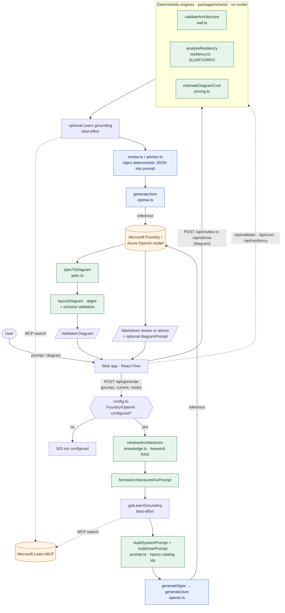
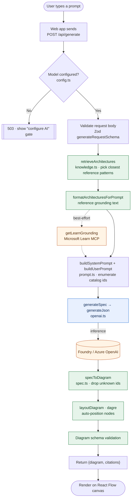

# Architecture flow: prompt, AI, and deterministic calls

This diagram traces a request through the two AI paths in the app and shows where
work is **deterministic** (pure functions in `packages/shared`, no model), where it
is **AI** (a model call), and where it reaches **external** services.

The analytical intelligence — Well-Architected, resiliency, and cost — is computed
deterministically and injected into the prompt. The model synthesizes prose over
verified numbers rather than inventing them (see
[ADR-0019](adr/0019-single-synthesizer-over-multi-agent.md),
[ADR-0014](adr/0014-in-app-ai-architecture-review.md)).

## Legend

- **Green — deterministic** (no model): retrieval/RAG, WAF, resiliency, cost,
  layout, and schema validation. All in `packages/shared` or pure API helpers.
- **Blue — AI**: the only two model touchpoints — `generateSpec`
  (prompt → diagram) and `generateJson` (review/advice synthesis), both through
  [`apps/api/src/ai/openai.ts`](../apps/api/src/ai/openai.ts).
- **Orange — external**: the Foundry / Azure OpenAI model endpoint and the
  Microsoft Learn MCP. Learn grounding is always best-effort and soft-fails.

## Notes

- Deterministic analysis is computed **before** the model call and injected into
  the prompt, so review and advice agree with the app's own panels by construction.
- The `/api/validate`, `/api/cost`, and `/api/resiliency` panels call the green
  engines directly with **no model call at all**.
- Foundry vs. Azure OpenAI is resolved in
  [`apps/api/src/config.ts`](../apps/api/src/config.ts); both flow through the same
  `openai.ts` inference helper.

## Prompt → presented diagram (happy path)

A focused view of a single generation request, from the user's words to the
rendered canvas. Dashed steps are best-effort and soft-fail without blocking.

Failure handling along this path:

- **No model** → `503`, the UI shows the "configure AI" gate (same as the review panel).
- **Bad request body** → `400` from the Zod schema.
- **Learn grounding fails** → ignored; generation proceeds on the reference patterns.
- **Model returns invalid ids** → `specToDiagram` drops them, so only real catalog services reach the canvas ([ADR-0010](adr/0010-ai-prompt-to-diagram.md)).

## Related

- [ADR-0010](adr/0010-ai-prompt-to-diagram.md) — prompt-to-diagram
- [ADR-0012](adr/0012-resiliency-sla-rpo-rto-modelling.md) — resiliency modelling
- [ADR-0014](adr/0014-in-app-ai-architecture-review.md) — in-app AI review
- [ADR-0016](adr/0016-unified-ai-advisor.md) — unified advisor
- [ADR-0019](adr/0019-single-synthesizer-over-multi-agent.md) — single synthesizer over per-pillar agents
